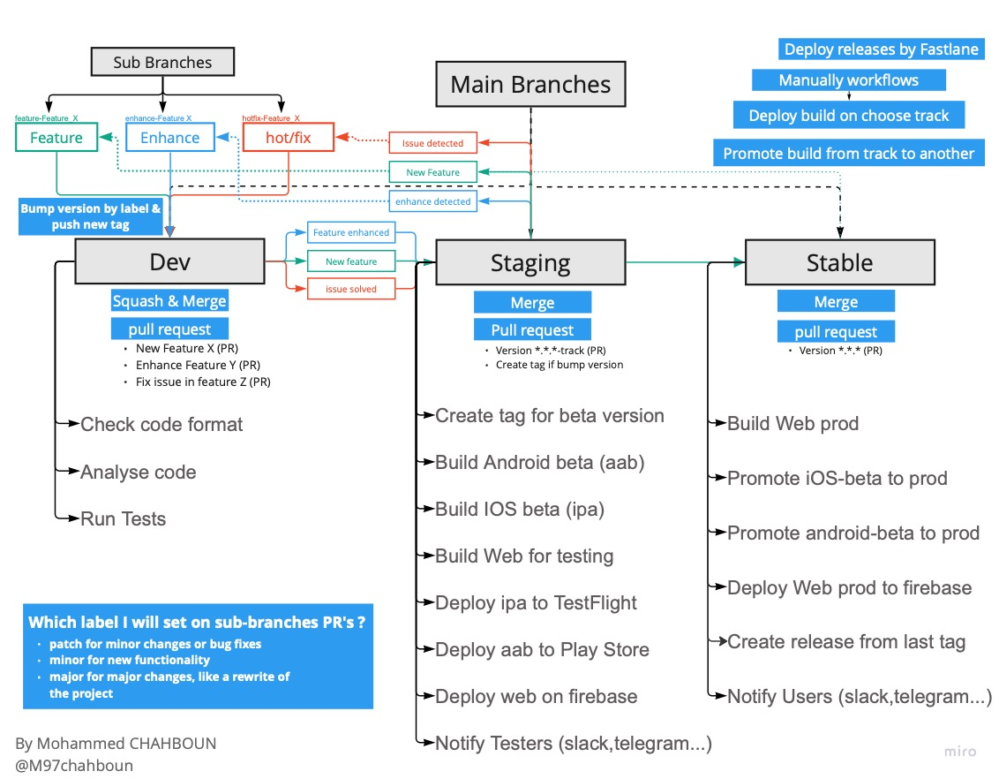

# Flutter CI CD & Branching Template

CI/CD, Branching & (optional VVR Architecture) template for flutter apps.

`VVR` : ViewModel View Request based on [MVCRocket Package](https://github.com/JahezAcademy/mvc_rocket/)

Supported Platforms : Android & web

WIP : Windows, Linux, Mac, & IOS

## REPO WORKFLOW

## TODO
- [x] Bump version based on labels when label PR on dev branch
- [x] Create tag based on current version
- [x] Analyze & Test Dev branch PR
- [x] Bump build (Version code) when merge PR on staging branch
- [x] Deploy Android to play store on testing track based on labels (default alpha) 
- [x] Deploy Web for testing
- [ ] Deploy IOS on Testflight for Testing
- [ ] Notify Testers (slack, telegram...)
- [x] Promote Android to production when merge PR on stable branch
- [ ] Promote IOS to production when merge PR on stable branch
- [x] Deploy Web to production when merge PR on stable branch
- [ ] Upload desktop version on release assets (windows, linux & mac)
- [x] Create release & generate release notes based on PR's when merge PR on stable
- [ ] Notify Users (slack, telegram...)
- [x] Manually Workflows for deploy & promote build

## HOW TO USE
1. Click to `Use this template` button & check `Include all branches`
2. Add follow keys to https://github.com/username/repo/settings/secrets/actions replace username & repo :
	- `PLAY_STORE_UPLOAD_KEY` : Past your keystore file encode64 you can use [this](https://www.base64encode.org) for encode file
	- `REPO_TOKEN` : Follow [steps](https://docs.github.com/en/authentication/keeping-your-account-and-data-secure/creating-a-personal-access-token)
	- `KEYSTORE_STORE_PASSWORD` : storePassword from key.properties file
	- `KEYSTORE_KEY_PASSWORD` : keyPassword from key.properties file
	- `KEYSTORE_KEY_ALIAS` : keyAlias from key.properties file
	- `GCP_SA_KEY` :  normal service account key(json format) or a base64 encoded service account key with the needed permissions for what you are trying to deploy/update. If you're deploying functions, you would also need the Cloud Functions Developer role, and the Cloud Scheduler Admin for scheduled functions. Since the deploy service account is using the App Engine default service account in the deploy process, it also needs the Service Account User role. If you're only doing Hosting, Firebase Hosting Admin is enough. https://firebase.google.com/docs/hosting/github-integration
	- `PLAY_STORE_CONFIG_JSON`: follow [steps](https://www.skoumal.com/en/generate-json-key-for-google-play-deployment/)
3. Create required labels :
	- for sub branches (feature, enhance, fix) branches create `major`, `minor` & `patch` labels as part of version
	- for staging branch we need `alpha`, `beta` & `internal` labels as tracks
4. Make sure you follow the workflow in [the image](repo_workflow.jpg) Particular how you merge your PR.

## RESSOURCES & TOOLS
- [Fastlane](https://fastlane.tools)
- [Github Workflow](https://docs.github.com/en/actions/using-workflows)
- [Use any programming language on github workflow](https://medium.com/@m97chahboun/how-to-use-any-programming-language-on-github-workflow-f5e389cfd886), [alernative link](https://dev.to/m97chahboun/how-to-use-any-programming-language-on-github-workflow-399m)
- [bump flutter app version fastlane-plugin](https://github.com/M97Chahboun/fastlane-plugin-flutter_bump_version)
- [MVCRocket Package](https://github.com/JahezAcademy/mvc_rocket/)

⚙️ Feel free to add 💡 idea or 🖥 contribute 😊